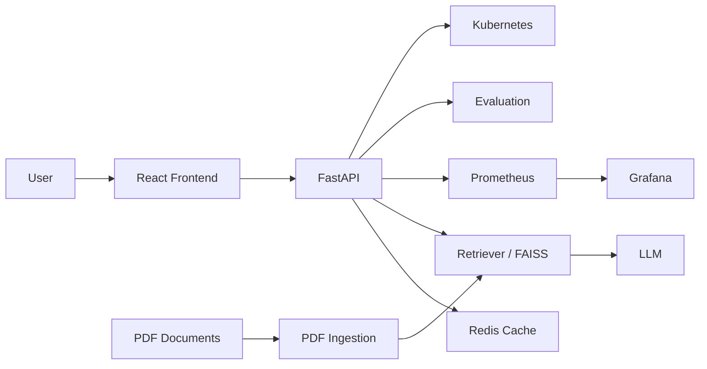

# Architecture Diagram

The recruiter-ready PNG architecture diagram is included in the downloadable project bundle. The GitHub connector used for this build can write source files but cannot attach binary PNG assets directly.

